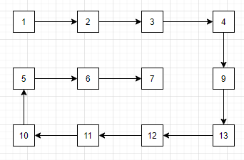
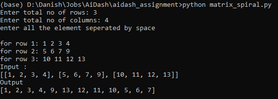
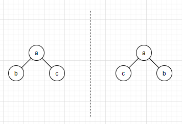
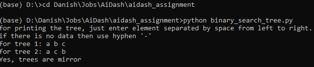
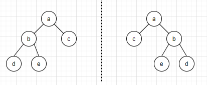
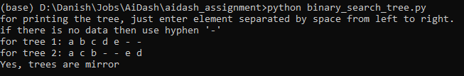
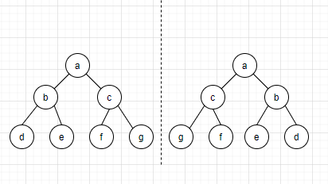
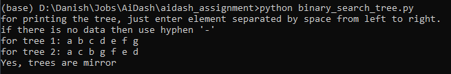
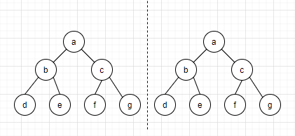
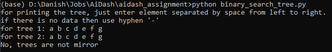

# AiDash Assignment

## Problem 1 - Matrix Spiral Print

Given a rectangular matrix of size M x N. Need to implement a method of printing the given matrix in spiral form. For e.g.

## Problem 2 - Binary Trees Mirror or Not

Given 2 binary search trees. Need to implement a method to check if 2 trees are mirror image of each other or not. 

